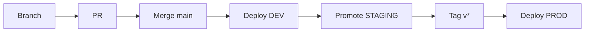

# GLPI-SoEnergy


Repositório privado para padronizar, automatizar e operar a implantação do **GLPI** na SoEnergy em ambientes corporativos (**dev, staging, prod**).

---

## 📑 Sumário

- [Visão Geral](#-visão-geral)
- [Arquitetura](#-arquitetura)
- [Quick Start](#-quick-start)
- [Estrutura](#-estrutura-do-repositório)
- [Padrões](#-padrões-do-projeto)
- [Fluxo de Deploy](#-fluxo-de-deploy)
- [CI/CD](#-cicd)
- [Segurança](#-segurança)
- [Operação](#-operação)
- [Contribuição](#-contribuição)

---

## 🎯 Visão Geral

Objetivos principais:

- Padronizar deploy do GLPI
- Garantir reprodutibilidade (IaC com Ansible)
- Automatizar pipeline (CI/CD)
- Proteger produção com approvals
- Facilitar colaboração e governança

---

## 🏗 Arquitetura

```mermaid
flowchart LR
    Dev[Developer] -->|PR| GitHub
    GitHub -->|CI| Actions
    Actions -->|Deploy| DEV[DEV ENV]
    DEV -->|Promote| STG[STAGING]
    STG -->|Tag Release| PROD[PROD]

    subgraph Infra
        APP[App Server\nNginx + PHP-FPM + GLPI]
        DB[(MariaDB/MySQL)]
    end

    APP --> DB
````

### Componentes

* **App Server**

  * Nginx
  * PHP-FPM
  * GLPI

* **DB Server**

  * MariaDB/MySQL (utf8mb4)

* **Segurança**

  * Firewall (3306 restrito)
  * HTTPS (Let's Encrypt)

---

## ⚡ Quick Start

```bash
git clone git@github.com:SoEnergy/GLPI-SoEnergy.git
cd GLPI-SoEnergy
```

### Pre-commit (opcional)

```bash
pipx install pre-commit || pip install --user pre-commit
pre-commit install
```

### Validação

```bash
ansible-playbook -i ansible/inventories/dev/hosts.ini ansible/site.yml --syntax-check
```

---

## 📁 Estrutura do Repositório

```plaintext
ansible/
  inventories/{dev,staging,prod}
  roles/{app,db}
web/
db/
scripts/
.github/workflows/
prompts/
docs/
```

---

## 📏 Padrões do Projeto

### Branching

* trunk-based
* `main` sempre deployável

### Prefixos

* feat/
* fix/
* chore/
* docs/

### Commits

```bash
tipo(escopo): descrição
```

### Pull Requests

* CI obrigatório
* Checklist obrigatório
* 1–2 reviewers

---

## 🔄 Fluxo de Deploy



---

## 🚀 CI/CD

### CI

* ansible-lint
* yamllint
* shellcheck
* syntax-check
* nginx -t
* DB test

### Deploy

| Ambiente | Trigger   |
| -------- | --------- |
| DEV      | push main |
| STAGING  | manual    |
| PROD     | tag       |

### Regras

* Approval obrigatório (staging/prod)
* Concurrency por ambiente
* Smoke test automático

---

## 🔐 Segurança

### Segredos

* GitHub Secrets
* Ansible Vault / SOPS

### Regras

* Nunca versionar `.env`
* SSH restrito
* DB restrito ao app

### Permissões

```bash
chown -R root:root /var/www/glpi-<versao>
chown -R www-data:www-data /var/www/glpi/{files,config,marketplace}
```

---

## ⚙️ Operação

### Smoke Test

```bash
./scripts/smoke-test.sh https://glpi.soenergy.com 30 2
```

### Backup

* Banco: mysqldump (retenção 14 dias)
* Arquivos:

  * files/
  * config/

### Restore

* Testes periódicos obrigatórios

---

## 🖥 Instalação

### App

```bash
/var/www/glpi-<versao>
/var/www/glpi -> symlink
```

### DB

* utf8mb4_unicode_ci
* Grants restritos

---

## 🤖 IA / Automação

* `AGENTS.md` → regras globais
* `prompts/` → especializações:

  * PR
  * commit
  * CI/CD
  * segurança

---

## 🤝 Contribuição

* Apenas via PR
* CI obrigatório
* CODEOWNERS ativo
* Padrões obrigatórios

---

## 📄 Licença

Privado

---

## 📄 Licença e contato

* **Licença:** Interna/Privada (conforme política da Empresa).
* **Responsável pelo Projeto:** [Renato de Souza Valadares](https://github.com/renatovaladares85)
* **Contato:** [rsvaladares@stefanini.com](mailto:rsvaladares@stefanini.com) ou via canal interno da equipe de ITSM.

