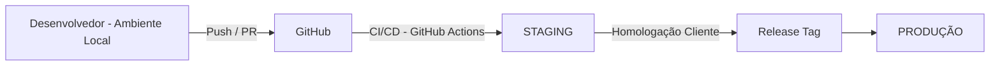
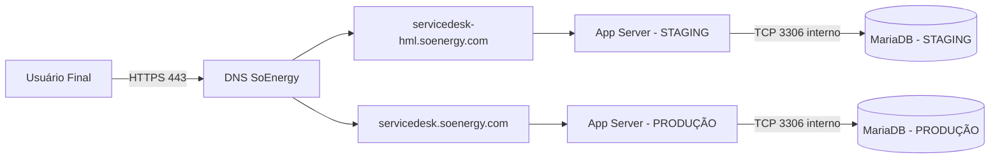

# GLPI-SoEnergy


Repositório privado para padronizar, automatizar e operar a implantação do **GLPI** na SoEnergy em ambientes corporativos (**staging e produção**).

---

## 📑 Sumário

* [Visão Geral](#-visão-geral)
* [Arquitetura](#-arquitetura)
* [Fluxo de Deploy](#-fluxo-de-deploy)
* [Acesso do Cliente](#-acesso-do-cliente)
* [Infraestrutura](#-infraestrutura)
* [CI/CD](#-cicd)
* [Segurança](#-segurança)
* [Operação](#-operação)
* [Instalação](#-instalação)
* [Estrutura do Repositório](#-estrutura-do-repositório)
* [Padrões do Projeto](#-padrões-do-projeto)
* [Contribuição](#-contribuição)

---

## 🎯 Visão Geral

Objetivos principais:

* Padronizar deploy do GLPI
* Garantir reprodutibilidade com **Ansible (IaC)**
* Automatizar pipeline com **GitHub Actions**
* Separar ambientes (staging e produção)
* Garantir segurança e governança corporativa

---

## 🏗 Arquitetura

### Visão Geral


---

### Ambientes

| Ambiente | URL                                  |
| -------- | ------------------------------------ |
| STAGING  | https://servicedesk-hml.soenergy.com |
| PRODUÇÃO | https://servicedesk.soenergy.com     |

---

## 🔄 Fluxo de Deploy



---

## 🌐 Acesso do Cliente



### Observações

* Acesso externo ocorre via **HTTPS (443)**
* DNS público da SoEnergy direciona para a infraestrutura interna
* Pode utilizar:

  * VPN
  * Túnel seguro
  * Proxy reverso corporativo
* Banco de dados **não é exposto externamente**

---

## 🏢 Infraestrutura

### STAGING (Homologação)

* **App Server**

  * Nginx
  * PHP-FPM
  * GLPI
  * OPcache / APCu
  * Logs

* **DB Server**

  * MariaDB
  * Engine InnoDB
  * UTF8MB4
  * Acesso restrito (somente App Server)

---

### PRODUÇÃO

* **App Server**

  * Nginx
  * PHP-FPM
  * GLPI
  * OPcache / APCu

* **DB Server**

  * MariaDB
  * Engine InnoDB
  * UTF8MB4
  * Acesso restrito (somente App Server)

---

## 🚀 CI/CD

### Pipeline

* ansible-lint
* yamllint
* shellcheck
* syntax-check
* nginx -t
* Testes de banco

### Deploy

| Ambiente | Trigger                    |
| -------- | -------------------------- |
| STAGING  | automático (merge em main) |
| PROD     | tag (release)              |

### Regras

* Approval obrigatório para produção
* Concurrency por ambiente
* Smoke test automatizado

---

## 🔐 Segurança

* HTTPS obrigatório (TLS)
* Firewall liberando apenas portas necessárias
* Banco acessível somente internamente (porta 3306)
* Uso de:

  * GitHub Secrets
  * Ansible Vault / SOPS
* SSH restrito
* Hardening do servidor (Nginx, PHP, OS)

---

## ⚙️ Operação

### Smoke Test

```bash
./scripts/smoke-test.sh https://servicedesk.soenergy.com 30 2
```

### Backup

* Banco: `mysqldump`

* Retenção:

  * STAGING: 14 dias
  * PROD: 30 dias

* Arquivos:

  * `/files`
  * `/config`

### Restore

* Testes periódicos obrigatórios

---

## 🖥 Instalação

### App

```bash
/var/www/glpi-<versao>
/var/www/glpi -> symlink
```

### DB

* Charset: utf8mb4
* Collation: utf8mb4_unicode_ci
* Grants restritos

---

## 📁 Estrutura do Repositório

```plaintext
ansible/
  inventories/{dev,staging,prod}
  roles/{app,db}
web/
db/
scripts/
.github/workflows/
prompts/
docs/
  architecture.png
```

---

## 📏 Padrões do Projeto

### Branching

* trunk-based
* `main` sempre estável

### Prefixos

* feat/
* fix/
* chore/
* docs/

### Commits

```bash
tipo(escopo): descrição
```

### Pull Requests

* CI obrigatório
* Checklist obrigatório
* 1–2 reviewers

---

## 🤖 Automação / IA

* `AGENTS.md` → regras globais
* `prompts/` → especializações:

  * PR
  * commit
  * CI/CD
  * segurança

---

## 🤝 Contribuição

* Apenas via PR
* CI obrigatório
* CODEOWNERS ativo
* Padrões obrigatórios

---

## 📄 Licença

Privado

---

## 📄 Contato

* **Responsável:** Renato de Souza Valadares
* **Email:** [rsvaladares@stefanini.com](mailto:rsvaladares@stefanini.com)
