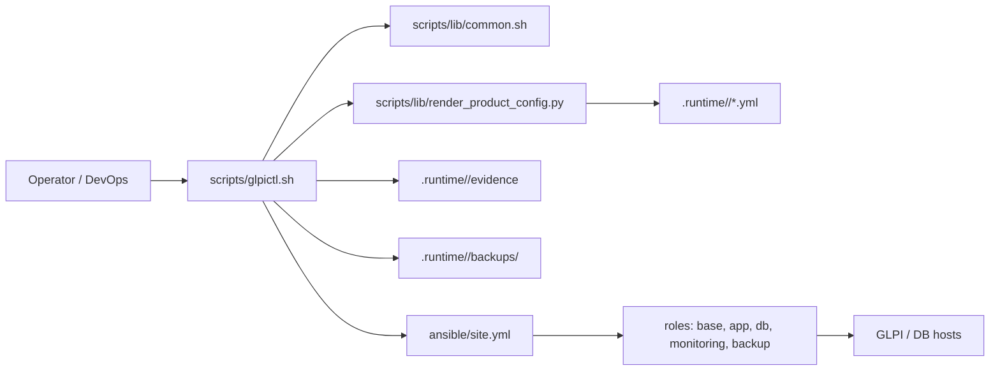
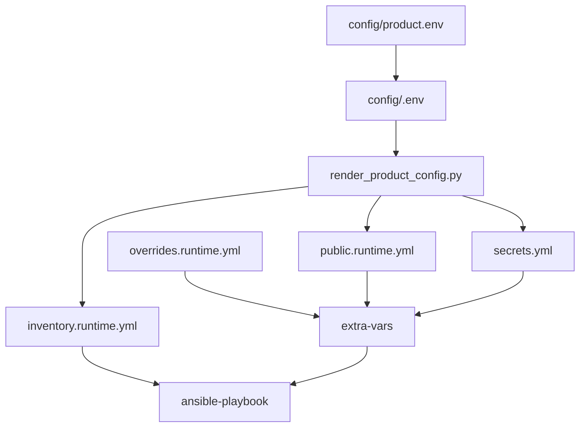
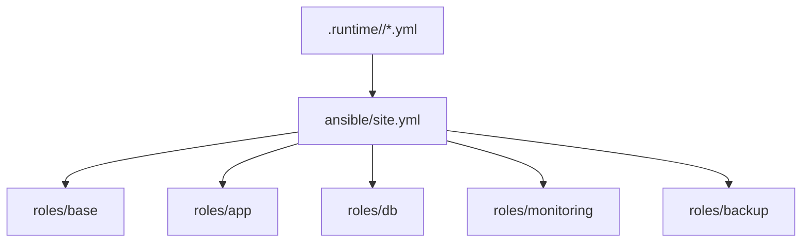
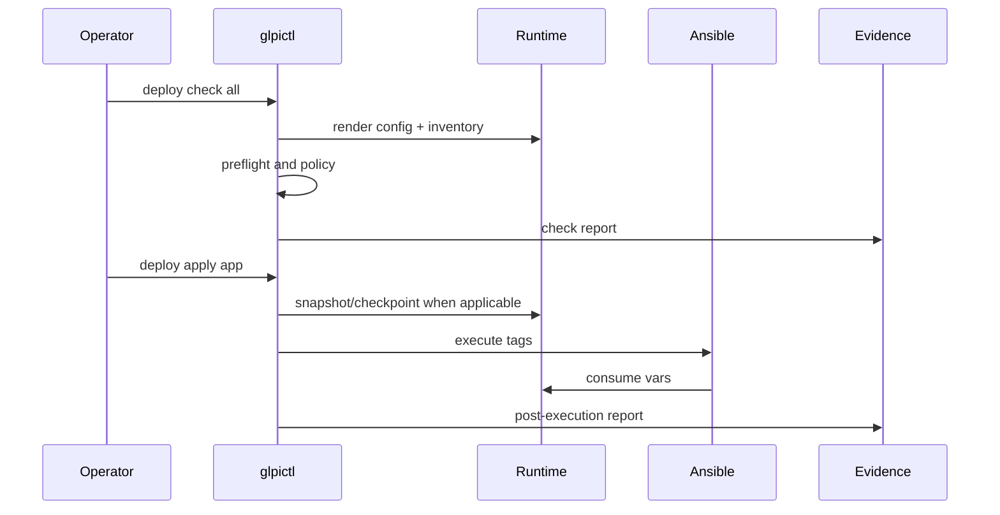
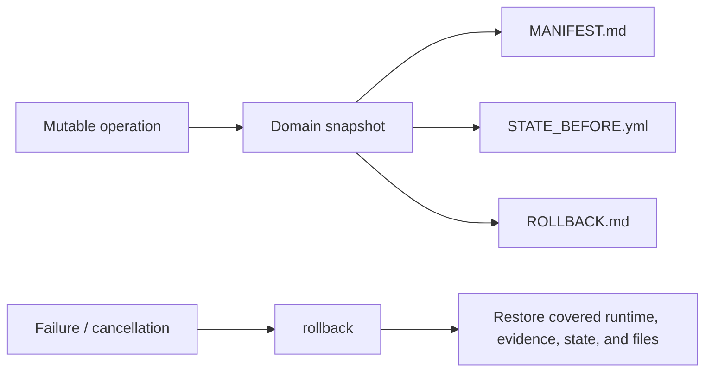

# Architecture, Capabilities, and Contribution

This manual is for developers, DevOps engineers, maintainers, and open source contributors who need to understand how the GLPI Operations Kit works internally and how to modify it safely.

The operator installation manual lives in [docs/manual](../../manual/README.md). Mandatory standards live in [docs/standards](../../standards/index.md).

## Index

1. [Project objective](#project-objective)
2. [High-level architecture](#high-level-architecture)
3. [Directory map](#directory-map)
4. [Data flow and runtime](#data-flow-and-runtime)
5. [CLI and operational domains](#cli-and-operational-domains)
6. [Ansible architecture](#ansible-architecture)
7. [Operational architecture](#operational-architecture)
8. [Security and rollback](#security-and-rollback)
9. [How to modify the project](#how-to-modify-the-project)
10. [Pull request checklist](#pull-request-checklist)

## Project objective

The GLPI Operations Kit standardizes GLPI installation, configuration, and operation on Linux with Bash, Ansible, and auditable runtime artifacts. The project aims to be reusable, secure, predictable, and easy to audit.

Main principles:

- public configuration in `config/<environment>.env`;
- secrets outside Git, in `.runtime/<environment>/secrets.yml`;
- runtime generated by scripts, not manually edited as the primary source;
- operational commands idempotent when possible;
- evidence and snapshots for audit and rollback;
- separation between staging, production, and other environments;
- small, traceable, reversible changes.

## High-level architecture



Core components:

| Component | Responsibility |
|---|---|
| `scripts/glpictl.sh` | Main CLI and dispatcher for operational domains. |
| `scripts/lib/common.sh` | Shared functions: runtime, preflight, secrets, logs, Ansible, permissions. |
| `scripts/lib/render_product_config.py` | Converts `config/<environment>.env` into runtime YAML and inventory. |
| `ansible/site.yml` | Orchestrates roles by tags and host groups. |
| `ansible/roles/*` | Implements idempotent configuration by technical domain. |
| `.runtime/<environment>/` | Generated state: inventory, public runtime, overrides, secrets, logs, evidence, backups. |
| `docs/standards/*` | Mandatory rules for project changes. |

## Directory map

| Directory or file | Use |
|---|---|
| `config/product.env` | Versioned template for the public configuration contract. |
| `config/<environment>.env` | Operator-created environment copy; do not commit real values. |
| `scripts/glpictl.sh` | Main operational interface. |
| `scripts/lib/common.sh` | Common Bash library. |
| `scripts/lib/render_product_config.py` | Configuration and inventory renderer. |
| `scripts/deploy-*.sh`, `scripts/manage-tls.sh`, `scripts/ops-maintenance.sh` | Legacy/compatible scripts used by existing flows. |
| `ansible/site.yml` | Main playbook. |
| `ansible/roles/base` | Operating system baseline. |
| `ansible/roles/app` | GLPI, PHP-FPM, web engine, secure paths. |
| `ansible/roles/db` | MariaDB, schema, users, grants. |
| `ansible/roles/monitoring` | Exporters and monitoring files. |
| `ansible/roles/backup` | GLPI files and MariaDB backup scripts. |
| `docs/manual` | Operator and installation manual. |
| `docs/product` | Product and configuration references. |
| `docs/standards` | Mandatory engineering and operations standards. |
| `docs/architecture` | Technical architecture and contribution manual. |

## Data flow and runtime



Effective precedence:

1. `.runtime/<env>/public.runtime.yml`
2. `.runtime/<env>/overrides.runtime.yml`
3. `.runtime/<env>/secrets.yml`

Important rules:

- `config/product.env` is the versioned template.
- `config/<environment>.env` is the environment input.
- `.runtime/` is generated and must not be versioned.
- `overrides.runtime.yml` stores mutable changes, such as TLS switches, without changing the public baseline.
- External-auth secrets stay only in `.runtime/<environment>/secrets.yml`.

## CLI and operational domains

Official syntax:

```bash
./scripts/glpictl.sh <environment> <domain> <action> [target] [scope]
```

Known domains:

| Domain | Function |
|---|---|
| `deploy` | Runs check, prepare, apply, post-check, and rollback for base installation. |
| `tls` | Operates TLS modes `none`, `self_signed`, and `provided`, while keeping legacy aliases. |
| `auth` | Prepares/validates `local`, `ldap`, `saml`, `oidc` authentication and SSO evidence. |
| `ops` | Day-2 operations, users, certificates, audit, and local metadata rollback. |
| `audit` | Operational checks and audit evidence. |
| `certify` | Staging certification and evidence for promotion. |
| `promote` | Controlled production promotion and rollback metadata. |
| `db` | Database component inside `deploy`. |
| `app` | Application component inside `deploy`. |
| `monitoring` | Observability component inside `deploy`. |
| `backup` | Backup component inside `deploy`. |

Desired domain flow when applicable:

```bash
./scripts/glpictl.sh <env> <domain> check
./scripts/glpictl.sh <env> <domain> prepare
./scripts/glpictl.sh <env> <domain> apply
./scripts/glpictl.sh <env> <domain> post-check
./scripts/glpictl.sh <env> <domain> rollback
```

Not every domain needs every action. Compatibility with existing commands has priority.

## Ansible architecture



Current roles:

| Role | Responsibility |
|---|---|
| `base` | Base packages, timezone, initial hardening, OS handlers. |
| `app` | GLPI, PHP-FPM, web templates, `public` webroot, cron, permissions. |
| `db` | MariaDB, configuration, user, password, schema, grants, bind. |
| `monitoring` | Node exporter, mysqld exporter, support files. |
| `backup` | GLPI file and MariaDB backup scripts. |

Ansible standards:

- small, focused roles;
- `.j2` templates for variable configuration;
- secrets only through runtime;
- validation with `ansible-inventory --list` and `ansible-playbook --syntax-check ansible/site.yml` when applicable;
- idempotency preserved whenever possible;
- tags coherent with domain/component.

## Operational architecture



Main concepts:

| Concept | Description |
|---|---|
| Preflight | Checks tools, permissions, config, inventory, policy, and security before mutation. |
| `secure` | Policy violations block execution. |
| `permissive` | Policy violations become warnings with mandatory justification and evidence. |
| Logs | `.runtime/<env>/logs/` records execution and summary. |
| State | `.runtime/<env>/state/` stores checkpoints and pointers. |
| Evidence | `.runtime/<env>/evidence/` stores auditable reports. |
| Backups | `.runtime/<env>/backups/<domain>/<timestamp>/` stores domain snapshots. |

## Security and rollback

Base security:

- never version secrets;
- keep `.runtime/` out of Git;
- keep sensitive directories outside the webroot;
- GLPI webroot must point to `public`;
- preserve local/admin login when preparing SSO;
- never write tokens, passwords, or private certificates to logs/evidence;
- use `secure` policy by default.

Domain rollback:



When adding a mutable operation, implement backup before mutation, manifest, previous state, evidence, and rollback. If the operation changes DB, remote services, or system files, clearly document what is restored automatically and what requires external operational action.

## How to modify the project

### Add a new operational domain

1. Define the domain objective and which actions make sense.
2. Add dispatcher logic in `scripts/glpictl.sh` without breaking existing domains.
3. Reuse runtime, state, evidence, and backup helpers when possible.
4. Implement `check` as non-mutating.
5. Make `prepare/apply/rollback` create snapshots when they change state.
6. Generate evidence without secrets.
7. Update manuals and command reference.
8. Run minimum validations.

### Add a new action

The action must declare whether it is mutable. If mutable:

- resolve runtime first;
- validate policy;
- create domain snapshot;
- record evidence;
- provide clear rollback;
- preserve compatibility with legacy syntax.

### Add a new `.env` key

1. Add the key to `config/product.env` with comment, format, and safe example.
2. Map it in `scripts/lib/render_product_config.py` when consumed by runtime.
3. Validate format and defaults in the renderer or appropriate domain.
4. Never make a new key mandatory without evaluating compatibility.
5. Update the configuration guide, examples, and architecture docs when needed.
6. If it is a secret, keep it in `.runtime/<environment>/secrets.yml`.

### Add or change an Ansible role

1. Keep the role small and cohesive.
2. Use `.j2` templates for variable configuration.
3. Consume rendered runtime variables.
4. Do not put secrets in defaults, versioned inventory, or final templates with real values.
5. Use handlers for reload/restart.
6. Validate syntax-check.
7. Document impact and rollback.

### Update standards

If a change creates a recurring rule, update the correct thematic file in `docs/standards/`. Do not duplicate rules in multiple places. If an error repeats, record it in `docs/standards/learned-lessons.md`.

## Pull request checklist

Before opening a PR:

- small, coherent scope;
- non-protected branch;
- Conventional Commit;
- no secrets, tokens, private certificates, or `.runtime/`;
- compatibility with existing commands;
- documented rollback for mutable operations;
- documentation updated;
- `git diff --check` passes;
- `bash -n` on changed scripts;
- `ansible-inventory --list` and `ansible-playbook --syntax-check ansible/site.yml` when Ansible is affected;
- smoke test for affected domain when applicable.

## Required reading for contributors

- [README](../../../README.md)
- [AGENTS](../../../AGENTS.md)
- [Standards Index](../../standards/index.md)
- [Operator Manual](../../manual/README.md)
- [Configuration Reference](../../product/configuration-reference.md)
