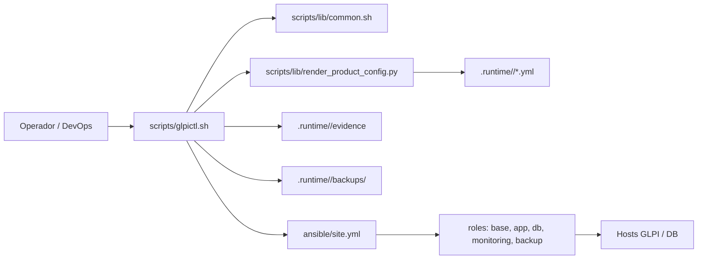
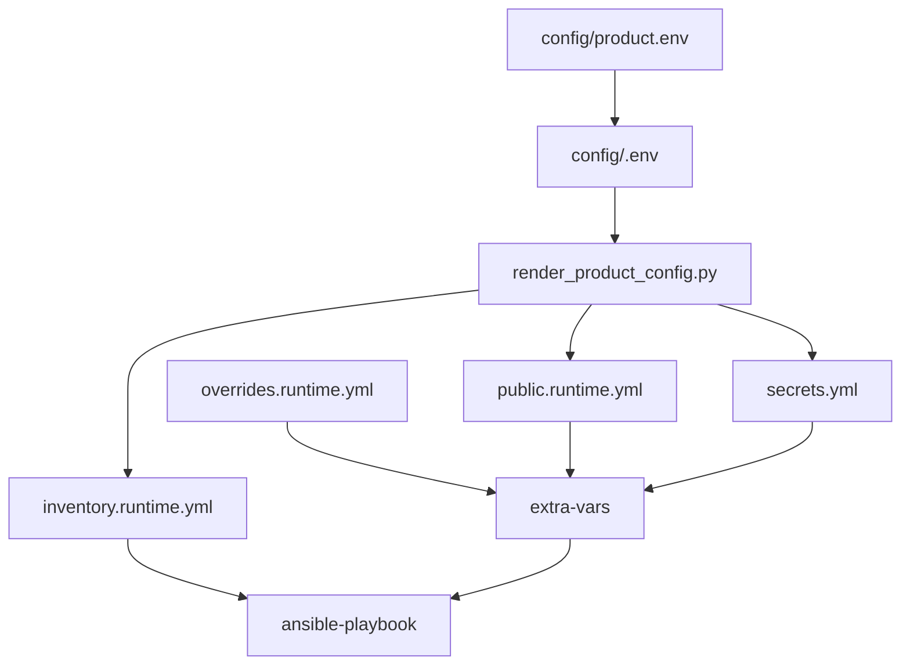
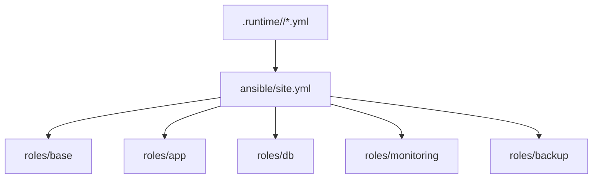
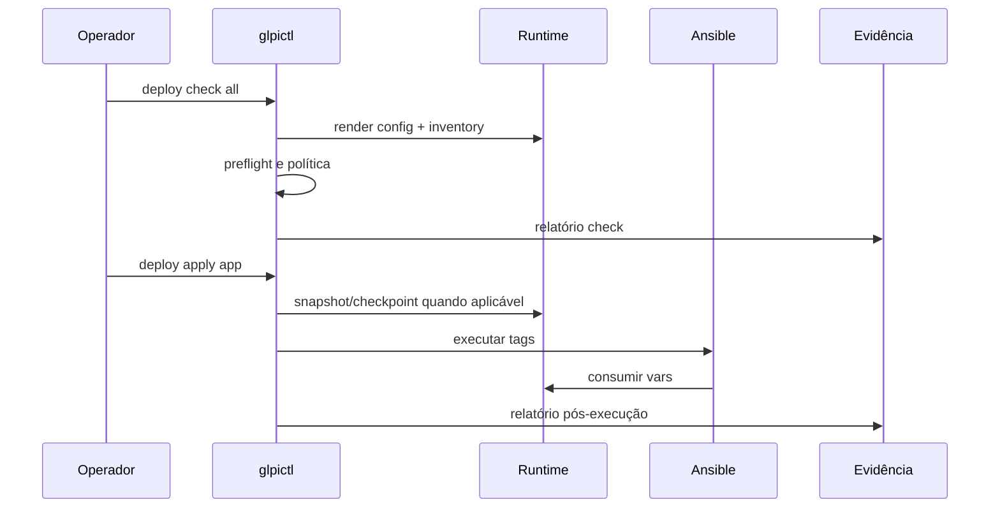
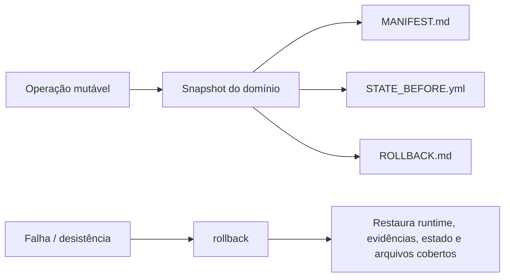

# Arquitetura, Funcionalidades e Contribuição

Este manual é para desenvolvedores, DevOps, mantenedores e contribuidores open source que precisam entender como o GLPI Operations Kit funciona internamente e como modificá-lo com segurança.

O manual de instalação para operadores fica em [docs/manual](../../manual/README.md). Os padrões obrigatórios ficam em [docs/standards](../../standards/index.md).

## Índice

1. [Objetivo do projeto](#objetivo-do-projeto)
2. [Arquitetura geral](#arquitetura-geral)
3. [Mapa de diretórios](#mapa-de-diretórios)
4. [Fluxo de dados e runtime](#fluxo-de-dados-e-runtime)
5. [CLI e domínios operacionais](#cli-e-domínios-operacionais)
6. [Arquitetura Ansible](#arquitetura-ansible)
7. [Arquitetura operacional](#arquitetura-operacional)
8. [Segurança e rollback](#segurança-e-rollback)
9. [Como modificar o projeto](#como-modificar-o-projeto)
10. [Checklist de pull request](#checklist-de-pull-request)

## Objetivo do projeto

O GLPI Operations Kit padroniza instalação, configuração e operação de GLPI em Linux com Bash, Ansible e runtime auditável. O projeto busca ser reutilizável, seguro, previsível e fácil de auditar.

Princípios principais:

- configuração pública em `config/<environment>.env`;
- segredos fora do Git, em `.runtime/<environment>/secrets.yml`;
- runtime gerado por scripts, não editado manualmente como fonte primária;
- comandos operacionais idempotentes quando possível;
- evidências e snapshots para auditoria e rollback;
- separação entre staging, production e outros ambientes;
- mudanças pequenas, rastreáveis e reversíveis.

## Arquitetura geral



Componentes centrais:

| Componente | Responsabilidade |
|---|---|
| `scripts/glpictl.sh` | CLI principal e dispatcher dos domínios operacionais. |
| `scripts/lib/common.sh` | Funções compartilhadas: runtime, preflight, segredos, logs, Ansible, permissões. |
| `scripts/lib/render_product_config.py` | Converte `config/<environment>.env` em runtime YAML e inventário. |
| `ansible/site.yml` | Orquestra roles por tags e grupos de hosts. |
| `ansible/roles/*` | Implementa configuração idempotente por domínio técnico. |
| `.runtime/<environment>/` | Estado gerado: inventário, runtime público, overrides, segredos, logs, evidências e backups. |
| `docs/standards/*` | Regras obrigatórias para mudanças no projeto. |

## Mapa de diretórios

| Diretório ou arquivo | Uso |
|---|---|
| `config/product.env` | Template versionado do contrato público de configuração. |
| `config/<environment>.env` | Cópia do ambiente criada pelo operador; não commitar valores reais. |
| `scripts/glpictl.sh` | Interface operacional principal. |
| `scripts/lib/common.sh` | Biblioteca Bash comum. |
| `scripts/lib/render_product_config.py` | Renderer de configuração e inventário. |
| `scripts/deploy-*.sh`, `scripts/manage-tls.sh`, `scripts/ops-maintenance.sh` | Scripts legados/compatíveis usados por fluxos existentes. |
| `ansible/site.yml` | Playbook principal. |
| `ansible/roles/base` | Baseline do sistema operacional. |
| `ansible/roles/app` | GLPI, PHP-FPM, engine web e paths seguros. |
| `ansible/roles/db` | MariaDB, schema, usuários e grants. |
| `ansible/roles/monitoring` | Exporters e arquivos de monitoramento. |
| `ansible/roles/backup` | Scripts e baseline de backup. |
| `docs/manual` | Manual de operador e instalação. |
| `docs/product` | Referências de produto e configuração. |
| `docs/standards` | Padrões obrigatórios de engenharia e operação. |
| `docs/architecture` | Manual técnico de arquitetura e contribuição. |

## Fluxo de dados e runtime



A precedência efetiva é:

1. `.runtime/<env>/public.runtime.yml`
2. `.runtime/<env>/overrides.runtime.yml`
3. `.runtime/<env>/secrets.yml`

Regras importantes:

- `config/product.env` é o template versionado.
- `config/<environment>.env` é a entrada do ambiente.
- `.runtime/` é gerado e não deve ser versionado.
- `overrides.runtime.yml` guarda mudanças mutáveis, como troca de TLS, sem alterar o baseline público.
- Segredos runtime ficam somente em `.runtime/<environment>/secrets.yml`.

## CLI e domínios operacionais

Sintaxe oficial:

```bash
./scripts/glpictl.sh <environment> <domain> <action> [target] [scope]
```

Domínios conhecidos:

| Domínio | Função |
|---|---|
| `deploy` | Executa check, prepare, apply, post-check e rollback para instalação base. |
| `tls` | Opera modos TLS `none`, `self_signed` e `provided`, mantendo aliases legados. |
| `ops` | Operações day-2, usuários, certificado, auditoria e rollback local de metadados. |
| `audit` | Checagens operacionais e evidências de auditoria. |
| `certify` | Certificação de staging e evidências para promoção. |
| `promote` | Promoção controlada para produção e metadados de rollback. |
| `db` | Componente de banco dentro do domínio `deploy`. |
| `app` | Componente de aplicação dentro do domínio `deploy`. |
| `monitoring` | Componente de observabilidade dentro do domínio `deploy`. |
| `backup` | Componente de backup dentro do domínio `deploy`. |

Fluxo padrão desejado para domínios quando aplicável:

```bash
./scripts/glpictl.sh <env> <domain> check
./scripts/glpictl.sh <env> <domain> prepare
./scripts/glpictl.sh <env> <domain> apply
./scripts/glpictl.sh <env> <domain> post-check
./scripts/glpictl.sh <env> <domain> rollback
```

Nem todo domínio precisa ter todas as ações se isso não fizer sentido. Compatibilidade com comandos existentes tem prioridade.

## Arquitetura Ansible



Roles atuais:

| Role | Responsabilidade |
|---|---|
| `base` | Pacotes base, timezone, hardening inicial e handlers de SO. |
| `app` | GLPI, PHP-FPM, templates web, webroot `public`, cron e permissões. |
| `db` | MariaDB, config, usuário, senha, schema, grants e bind. |
| `monitoring` | Node exporter, mysqld exporter e arquivos auxiliares. |
| `backup` | Scripts de backup de arquivos GLPI e MariaDB. |

Padrões Ansible:

- roles pequenas e focadas;
- templates `.j2` para configurações variáveis;
- segredos somente via runtime;
- validação com `ansible-inventory --list` e `ansible-playbook --syntax-check ansible/site.yml` quando aplicável;
- idempotência preservada sempre que possível;
- tags coerentes com domínio/componente.

## Arquitetura operacional



Conceitos principais:

| Conceito | Descrição |
|---|---|
| Preflight | Checa ferramentas, permissões, config, inventário, política e segurança antes de mutação. |
| `secure` | Violações de política bloqueiam a execução. |
| `permissive` | Violações viram warning com justificativa e evidência obrigatória. |
| Logs | `.runtime/<env>/logs/` registra execução e sumário. |
| State | `.runtime/<env>/state/` guarda checkpoints e ponteiros. |
| Evidence | `.runtime/<env>/evidence/` guarda relatórios auditáveis. |
| Backups | `.runtime/<env>/backups/<domain>/<timestamp>/` guarda snapshots por domínio. |

## Segurança e rollback

Segurança base:

- nunca versionar segredos;
- manter `.runtime/` fora do Git;
- manter diretórios sensíveis fora do webroot;
- webroot GLPI deve apontar para `public`;
- preservar login local/admin ao preparar SSO;
- não escrever tokens, senhas ou certificados privados em logs/evidências;
- usar política `secure` como padrão.

Rollback por domínio:



Ao adicionar operação mutável, implemente backup antes da alteração, manifesto, estado anterior, evidência e rollback. Se a operação alterar banco, serviço remoto ou arquivo de sistema, documente claramente o que é restaurável automaticamente e o que exige ação operacional externa.

## Como modificar o projeto

### Adicionar um novo domínio operacional

1. Defina o objetivo do domínio e quais ações fazem sentido.
2. Adicione o dispatcher em `scripts/glpictl.sh` sem quebrar domínios existentes.
3. Reuse helpers de runtime, state, evidence e backup quando possível.
4. Implemente `check` como não mutável.
5. Faça `prepare/apply/rollback` criarem snapshots quando alterarem estado.
6. Gere evidências sem segredos.
7. Atualize manuais e referência de comandos.
8. Rode validações mínimas.

### Adicionar uma nova action

A action deve declarar se é mutável. Se for mutável:

- resolver runtime antes;
- validar política;
- criar snapshot do domínio;
- registrar evidência;
- ter rollback claro;
- preservar compatibilidade com sintaxe legada.

### Adicionar uma nova chave no `.env`

1. Adicione a chave em `config/product.env` com comentário, formato e exemplo seguro.
2. Mapeie em `scripts/lib/render_product_config.py` quando a chave for consumida por runtime.
3. Valide formato e defaults no renderer ou no domínio apropriado.
4. Nunca torne obrigatória uma chave nova sem avaliar compatibilidade.
5. Atualize o guia de configuração, exemplos e docs de arquitetura se necessário.
6. Se for segredo, mantenha em `.runtime/<environment>/secrets.yml`.

### Adicionar ou alterar role Ansible

1. Preserve role pequena e coesa.
2. Use templates `.j2` para configurações variáveis.
3. Consuma variáveis renderizadas de runtime.
4. Não coloque segredos em defaults, inventário versionado ou templates finais com valor real.
5. Use handlers para reload/restart.
6. Valide syntax-check.
7. Documente impacto e rollback.

### Atualizar padrões

Se a mudança cria regra recorrente, atualize o arquivo temático correto em `docs/standards/`. Não duplique regras em múltiplos lugares. Se um erro se repetir, registre em `docs/standards/learned-lessons.md`.

## Checklist de pull request

Antes de abrir PR:

- escopo pequeno e coerente;
- branch não protegida;
- Conventional Commit;
- sem segredos, tokens, certificados privados ou `.runtime/`;
- compatibilidade com comandos existentes;
- rollback documentado para operação mutável;
- docs atualizadas;
- `git diff --check` sem erro;
- `bash -n` em scripts alterados;
- `ansible-inventory --list` e `ansible-playbook --syntax-check ansible/site.yml` quando Ansible for afetado;
- smoke test do domínio afetado quando aplicável.

## Leituras obrigatórias para contribuidores

- [README](../../../README.md)
- [AGENTS](../../../AGENTS.md)
- [Standards Index](../../standards/index.md)
- [Operator Manual](../../manual/README.md)
- [Configuration Reference](../../product/configuration-reference.md)
